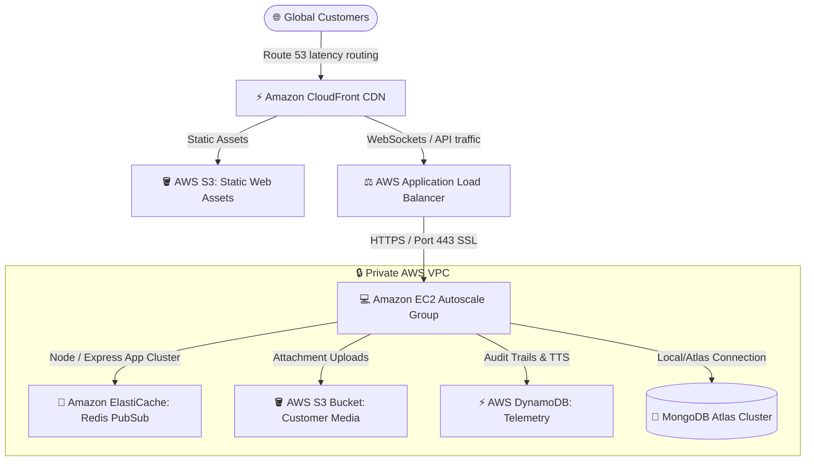

# 🚀 Production Deployment & AWS Infrastructure Guide: Nexus B2B SaaS

This guide outlines the production deployment runbook, high-availability architecture, and cloud infrastructure integration for the **Nexus AI-Powered Customer Support Ticketing Platform** on Amazon Web Services (AWS).

---

## 🏛️ Architecture Overview



Nexus is engineered as a decoupled, cloud-native architecture:
1. **Frontend**: Vite Single Page Application (SPA) compiled to pure static assets, hosted on **Amazon S3** and globally distributed with low latency via **Amazon CloudFront CDN**.
2. **Backend**: Node.js/Express REST and Socket.io server containerized and managed via **Amazon ECS (Elastic Container Service)** with Fargate (serverless containers) or hosted on load-balanced **Amazon EC2** behind an **Application Load Balancer (ALB)**.
3. **Database**: Managed **MongoDB Atlas** or multi-AZ document database with Redis clustering for caching Socket.io connection state across instances.

---

## 📦 Stage 1: Dockerization and Containerization (Local & Stage)

The Nexus repository is fully containerized for reproducibility across dev, staging, and production environments.

### Local Composition Orchestration

To run the complete production-like stack locally with a hot-reload database, execute:

```bash
# Spin up production services in background mode
docker-compose -f docker-compose.yml up -d --build
```

- **Frontend Nginx Proxy**: Port `80` (re-routes `/api` to the backend)
- **Express Core Engine**: Port `5500`
- **MongoDB Database service**: Port `27019`

---

## ☁️ Stage 2: AWS Cloud Infrastructure Provisioning

### 1. Simple Storage Service (Amazon S3) for Secure Media Attachments
Customer tickets frequently attach debugging screenshots or logs. We utilize S3 with presigned URLs to minimize server memory allocation.

#### IAM Policy for Nexus Application Server:
Create an IAM Role `NexusAppServerRole` and attach the following custom policy to permit S3 presigned operations:

```json
{
    "Version": "2012-10-17",
    "Statement": [
        {
            "Sid": "NexusS3MediaBucketAccess",
            "Effect": "Allow",
            "Action": [
                "s3:PutObject",
                "s3:GetObject",
                "s3:DeleteObject"
            ],
            "Resource": "arn:aws:s3:::nexus-support-media-attachments/*"
        }
    ]
}
```

#### CORS Configuration for S3 Bucket:
To permit frontend file uploads directly to S3 via presigned POST requests:

```json
[
    {
        "AllowedHeaders": ["*"],
        "AllowedMethods": ["GET", "POST", "PUT"],
        "AllowedOrigins": ["https://app.nexus.com", "http://localhost:5173"],
        "ExposeHeaders": ["ETag"],
        "MaxAgeSeconds": 3000
    }
]
```

---

### 2. Global Distribution via Amazon CloudFront (CDN)

To cache static frontend files (JS, CSS, SVGs) at AWS Edge Locations worldwide:
- **Origin**: S3 bucket `nexus-frontend-static-web`
- **Viewer Protocol Policy**: `Redirect HTTP to HTTPS`
- **Cache Policy**: `CachingOptimized` (Query strings, Headers, and Cookies forwarded only as required)
- **TTL Configuration**:
  - Minimum TTL: `0 seconds`
  - Default TTL: `86400 seconds` (24 Hours)
  - Maximum TTL: `31536000 seconds` (1 Year)

---

### 3. Application Host: EC2 Deployment & SSL configuration

For simple monolithic or small cluster VM deployments:

#### Production Nginx Reverse Proxy Config (`/etc/nginx/sites-available/nexus`):
Nginx terminates SSL (via Let's Encrypt Certbot) and handles standard reverse proxy forwarding with upgrade headers for Socket.io WebSocket connections.

```nginx
server {
    listen 80;
    server_name api.nexus.com;
    return 301 https://$host$request_uri;
}

server {
    listen 443 ssl http2;
    server_name api.nexus.com;

    ssl_certificate /etc/letsencrypt/live/api.nexus.com/fullchain.pem;
    ssl_certificate_key /etc/letsencrypt/live/api.nexus.com/privkey.pem;
    ssl_protocols TLSv1.2 TLSv1.3;
    ssl_ciphers HIGH:!aNULL:!MD5;

    # Backend Node Express API Routing
    location / {
        proxy_pass http://localhost:5500;
        proxy_http_version 1.1;
        proxy_set_header Upgrade $http_upgrade;
        proxy_set_header Connection 'upgrade';
        proxy_set_header Host $host;
        proxy_cache_bypass $http_upgrade;
        proxy_set_header X-Real-IP $remote_addr;
        proxy_set_header X-Forwarded-For $proxy_add_x_forwarded_for;
        proxy_set_header X-Forwarded-Proto $scheme;
    }

    # WebSockets / Socket.io Specific Endpoint Optimization
    location /socket.io/ {
        proxy_pass http://localhost:5500/socket.io/;
        proxy_http_version 1.1;
        proxy_set_header Upgrade $http_upgrade;
        proxy_set_header Connection "Upgrade";
        proxy_set_header Host $host;
        proxy_set_header X-Real-IP $remote_addr;
        proxy_set_header X-Forwarded-For $proxy_add_x_forwarded_for;
        proxy_read_timeout 86400; # Keep connections open
    }
}
```

---

## 🛠️ Step 4: Continuous Integration & Deployment (CI/CD)

Below is the robust GitHub Actions workflow file (`.github/workflows/deploy.yml`) for building Docker images and deploying to EC2 automatically on git pushes:

```yaml
name: Production Deployment to AWS EC2

on:
  push:
    branches: [ main ]

jobs:
  deploy:
    runs-on: ubuntu-latest
    steps:
      - name: Checkout Source Code
        uses: actions/checkout@v3

      - name: Configure SSH Key Access
        run: |
          mkdir -p ~/.ssh/
          echo "${{ secrets.AWS_EC2_SSH_KEY }}" > ~/.ssh/id_rsa
          chmod 600 ~/.ssh/id_rsa
          ssh-keyscan -H ${{ secrets.AWS_EC2_IP }} >> ~/.ssh/known_hosts

      - name: Deploy Containers on Host via SSH
        run: |
          ssh -i ~/.ssh/id_rsa ubuntu@${{ secrets.AWS_EC2_IP }} "
            cd /var/www/nexus &&
            git pull origin main &&
            export MONGO_URI='${{ secrets.MONGO_URI }}' &&
            export AWS_ACCESS_KEY_ID='${{ secrets.AWS_ACCESS_KEY_ID }}' &&
            export AWS_SECRET_ACCESS_KEY='${{ secrets.AWS_SECRET_ACCESS_KEY }}' &&
            export VITE_API_URL='https://api.nexus.com' &&
            docker-compose down &&
            docker-compose up -d --build
          "
```

---

## 📈 Stage 5: Production Maintenance and Monitoring

To maintain continuous 99.99% availability of B2B support sessions:
1. **Health Check Probes**: Set AWS ALB Target Group health checks to `/health` (Expected Status Code: `200 OK`).
2. **Horizontal Autoscale Rules**: ASG triggers scale-out instances when CPU utilization averages `>70%` for more than 3 consecutive evaluation periods of 1 minute.
3. **GenAI SLA Telemetry**: Active token quotas, translation latencies, and sentiment categorization are logged live to **AWS CloudWatch Logs** for analytics dashboards.
